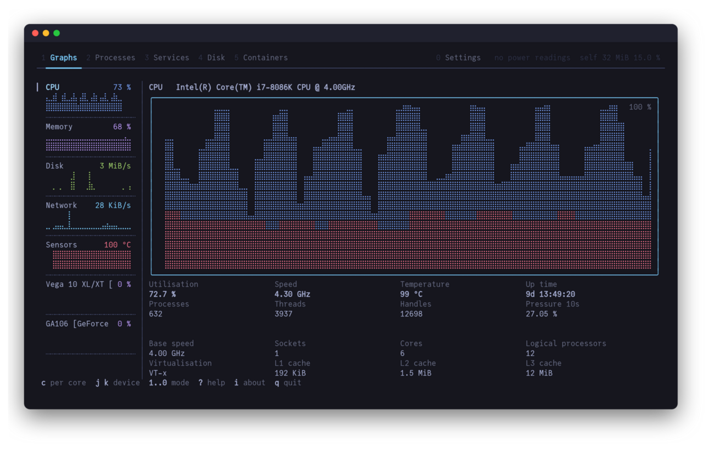
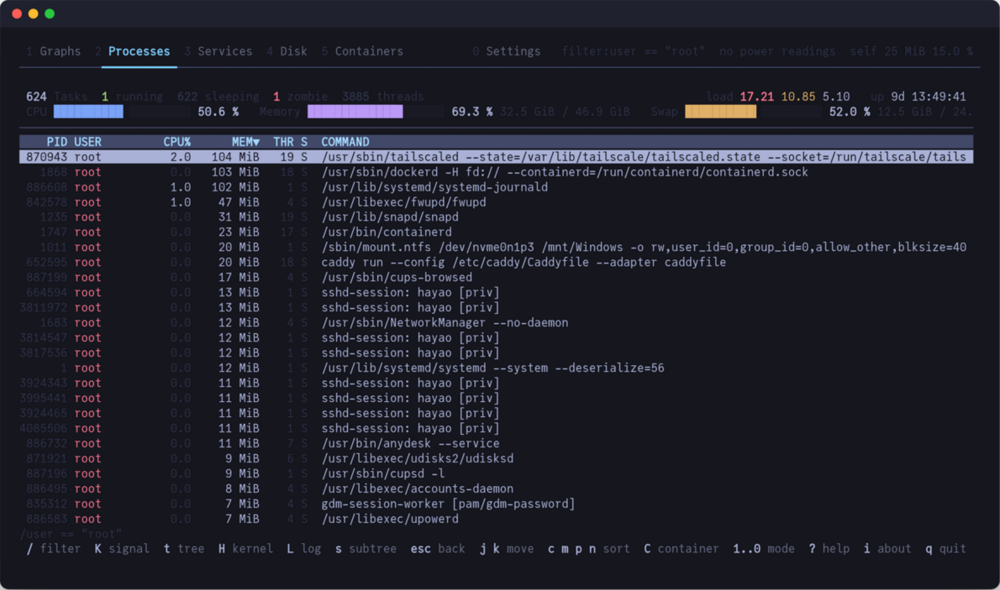
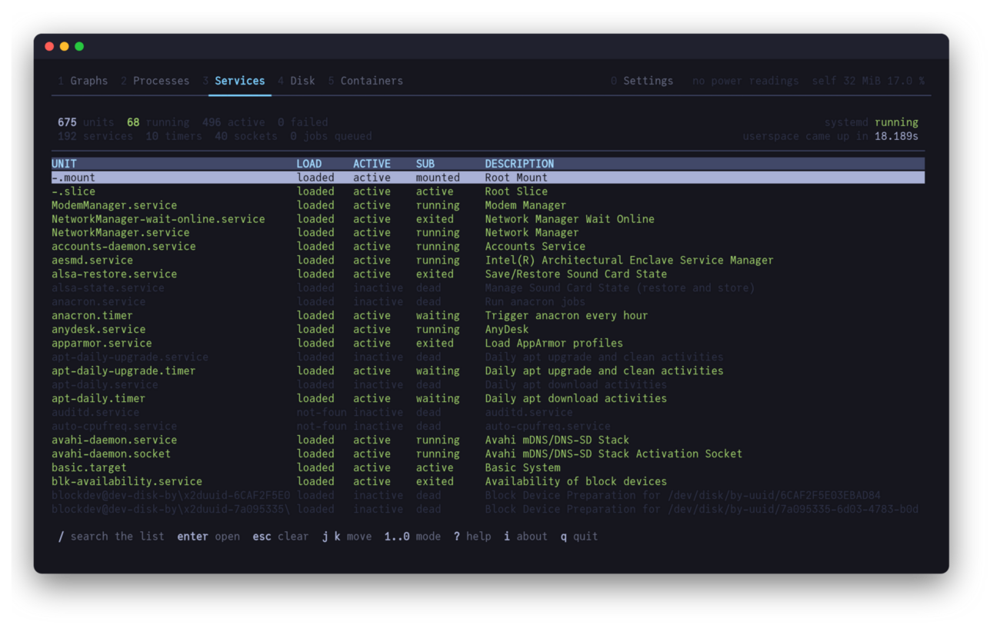
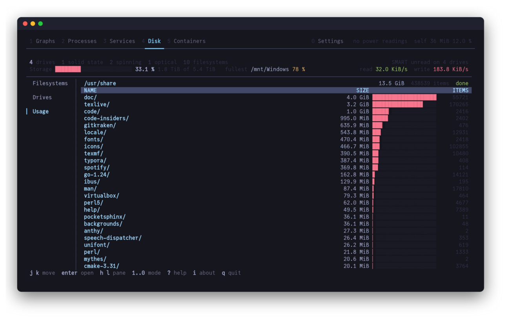
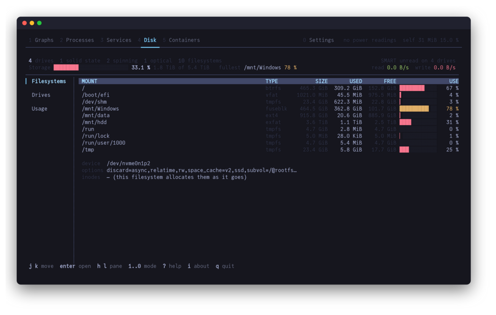

# hytop

*A system monitor for the terminal.*

[](https://github.com/Hayao0819/hytop/actions/workflows/ci.yml)
[](https://github.com/Hayao0819/hytop/releases)
[](go.mod)



Graphs, processes, storage, systemd units, and containers use the same interface
and keymap. hytop ships as a single Go binary.

## What it shows

The Graphs view covers CPU, memory, disks, network interfaces, sensors, and
GPUs. Battery-capable systems also get charge history and health.

<table>
<tr>
<td width="50%"></td>
<td width="50%"></td>
</tr>
<tr>
<td><b>Processes</b> — tree and flat views, sortable columns, and expression
filters. <kbd>K</kbd> sends a signal; <kbd>L</kbd> follows the journal for the
selected process's unit.</td>
<td><b>Services</b> — systemd units with failures first. Opening a unit follows
its journal live.</td>
</tr>
<tr>
<td></td>
<td></td>
</tr>
<tr>
<td><b>Disk usage</b> — browse directories, inspect their size, and remove
entries. Scans stop at mount boundaries and reuse measurements for unchanged
directories.</td>
<td><b>Filesystems and drives</b> — mounted filesystem usage and SMART
attributes read directly through device ioctls.</td>
</tr>
</table>

On Linux, the Containers view groups Docker and Podman processes using cgroup
metadata. <kbd>C</kbd> opens the process table filtered to the selected
container.

## Install

```sh
go install github.com/Hayao0819/hytop@latest
```

Or take a binary from [Releases](https://github.com/Hayao0819/hytop/releases).
Builds cover Linux (`amd64`, `arm64`, `386`, `riscv64`), macOS and Windows
(`amd64`, `arm64`).

All collectors are available on Linux, including systemd, containers, SMART,
and pressure metrics. macOS and Windows provide CPU, memory, disk, network, and
process views, plus battery information when available.

## Keys

| | |
|---|---|
| <kbd>1</kbd>…<kbd>5</kbd>, <kbd>0</kbd>, <kbd>Tab</kbd> | switch mode (1…3 on macOS and Windows) |
| <kbd>j</kbd> <kbd>k</kbd>, arrows | move; <kbd>h</kbd> <kbd>l</kbd> step between panes |
| <kbd>/</kbd> | filter or search |
| <kbd>t</kbd> <kbd>H</kbd> | process tree, kernel threads |
| <kbd>K</kbd> <kbd>L</kbd> <kbd>s</kbd> | signal, follow the journal, drill into a subtree |
| <kbd>c</kbd> <kbd>m</kbd> <kbd>p</kbd> <kbd>n</kbd> | sort |
| <kbd>?</kbd> | every binding, in context |

Run `hytop keys` to print the active bindings. Every entry can be rebound in the
configuration.

## Configure

On the first launch, hytop previews text contrast and graph glyphs,
then writes only the choices that differ from its defaults.

```toml
[appearance]
contrast = "high"

[general]
interval = "2s"

[filters]
hogs = "cpu > 5 or rss > 500e6"

[processes]
filter  = "hogs"
columns = ["pid", "user", "cpu", "rss", "threads", "state", "command"]

[keys]
"processes.sort-mem" = ["M"]

[[page]]
name = "overview"
  [[page.row]]
    [[page.row.child]]
    widget = "line"
    title = "CPU and memory"
    series = ["cpu.total.usage", "mem.usage"]
```

Write that to `~/.config/hytop/config.toml`; hytop reloads it while running.
Configuration is merged from `/etc/hytop/config.toml`, the user file,
`--profile <name>`, and command-line flags, in that order. Each TOML file may
contain a partial configuration.

```sh
hytop config paths                  # which layers exist
hytop config write                  # write the current settings out
hytop filter 'user == "root"'       # check an expression without starting the UI
```

The settings screen (<kbd>0</kbd>) edits the same values and <kbd>w</kbd> saves
them.

## Build

```sh
make check     # lint, build, tests under -race, dependency check
make build
```

Go 1.26 or later.

## License

[MIT](LICENSE)
